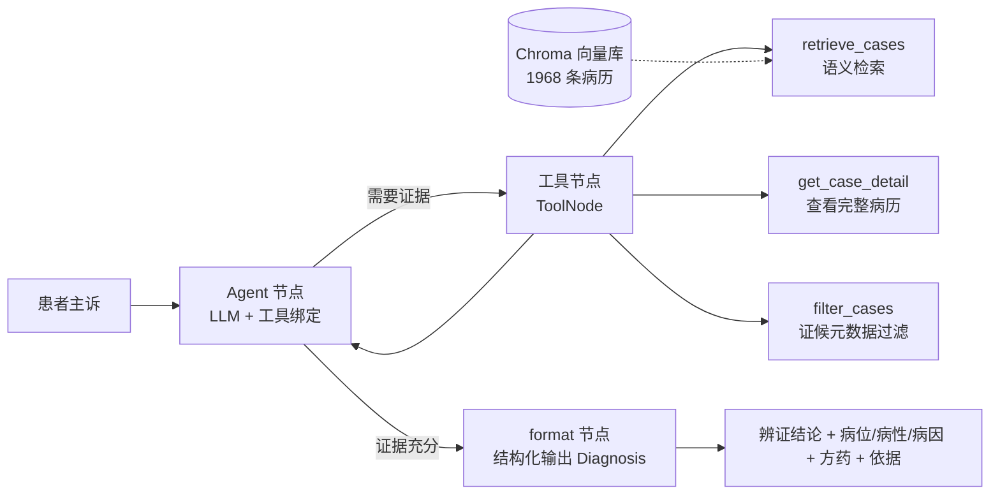

# 中医辨证诊断 Agent（RAG + 工具调用 + 可评测）

> 从「单轮 RAG 问答 demo」升级为「带工具调用、结构化输出、可量化评测的诊断 Agent」。
> 基于 **1968 条带金标准标签的真实中医病历**（`主诉` + `辨证结论` + `辨证证据链`），
> 保留中医垂直领域作为差异化，用**自动评测**量化「纯 LLM vs 单轮 RAG vs Agent」的提升。

## 架构



核心状态机：`START → agent →（有工具调用 ? tools → agent : format）→ END`，是一个标准的 **ReAct 循环**，由 LLM 自主决定调用哪些工具、调用几次。

## 目录结构

```
├── config.py              # 统一配置（读 .env）
├── src/
│   ├── data.py            # 数据加载 / 逐病历切块（带元数据）
│   ├── vectorstore.py     # embedding 工厂 + Chroma 封装 + CaseStore
│   ├── llm.py             # LLM 工厂（DeepSeek，OpenAI 兼容）
│   ├── schemas.py         # 结构化输出 Diagnosis（对齐辨证证据链）
│   ├── tools.py           # 3 个工具
│   ├── agent.py           # LangGraph 状态机
│   └── app.py             # Streamlit 界面
├── eval/                  # 评测：检索 / 端到端 / 三方对比
├── tests/                 # 单测
└── scripts/               # 建库 / 冒烟
```

## 快速开始

```bash
# 1. 安装（推荐 Python 3.10~3.12）
pip install -r requirements.txt

# 2. 配置密钥
cp .env.example .env   # 填入有效的 LLM_API_KEY（DeepSeek 或任意 OpenAI 兼容服务）

# 3. 重建向量索引（首次会下载 embedding 模型，约 400MB）
python scripts/build_index.py

# 4. 启动界面
streamlit run src/app.py
```

## 评测

```bash
# 检索评测：nDCG@k / MRR@k / AvgSim@k
python eval/run_retrieval.py

# Agent 端到端：结论一致性（LLM-judge）+ 病位/病性/病因对齐
python eval/run_agent.py --n 30

# 三方对比：纯 LLM / 单轮 RAG / Agent
python eval/compare.py --n 20

# 单测
pytest
```

评测结果输出到 `eval/output/*.json`（`retrieval.json` / `agent.json` / `compare.json`）。

### 指标说明

| 指标 | 含义 |
|---|---|
| 检索 nDCG@k / MRR@k / AvgSim@k | 以「检索病历 `辨证结论` 与金标准 `辨证结论` 的语义相似度」作分级相关性 |
| 结论一致性 | LLM-as-judge 判定预测辨证结论与金标准结论的语义一致度（0~1） |
| 病位/病性/病因对齐 | 预测证据 vs 金标准证据的双向最大余弦 F1 |
| 忠实度 | LLM-as-judge 判定回答是否被检索证据支撑（不臆造） |

> 关键设计：评测的 query 集（约 200 条）**永不进入向量库**，避免 Agent 直接检索到原病历「抄答案」。

### 实测结果（本机运行，DeepSeek + 1968 条病历）

**检索评测**（`run_retrieval.py`，200 条 query，top-5）：

| 指标 | 数值 |
|---|---|
| nDCG@5 | 0.948 |
| AvgSim@5 | 0.646 |
| MRR@5 | 0.104（阈值 0.85 对自由文本辨证结论过严，仅作参考） |

**多轮问诊的价值**（`run_agent.py --n 30`，LLM-judge 口径；控制变量：仅「是否问诊」不同）：

| 指标 | 无问诊 baseline | 问诊 Agent |
|---|---|---|
| 结论一致性（LLM-judge） | 0.46 | **0.56（+21%）** |
| 病位 / 病性 / 病因对齐 | 0.50 / 0.46 / 0.58 | 0.48 / 0.45 / 0.54 |

**三方对比**（`compare.py --n 20`，embedding 相似度口径）：

| 方案 | 结论相似度 | 病位对齐 | 病性对齐 | 病因对齐 | 平均 |
|---|---|---|---|---|---|
| 纯 LLM | 0.7366 | 0.4704 | 0.4030 | 0.4485 | 0.5146 |
| 单轮 RAG | 0.7405 | 0.5395 | 0.4580 | 0.5572 | 0.5738 |
| 问诊 Agent | 0.7405 | 0.5325 | 0.4384 | 0.5446 | 0.5640 |

> **诚实解读**：
> - **RAG 有效**：相对纯 LLM 平均提升约 +11%（embedding 口径）。
> - **多轮问诊有价值**：LLM-judge 严格语义判定下，问诊使结论一致性 +21%（0.46→0.56）——Agent 通过主动追问补全四诊信息，辨证更准。
> - **指标口径会改变结论**：同一批数据，embedding 相似度口径下问诊 Agent 与单轮 RAG 打平（0.7405），而 LLM-judge 口径下问诊明显胜出——embedding 相似度区分度低，是评测中的典型教训。
> - **证据对齐略降**：问诊 Agent 拿到更多信息后，病位/病性/病因短语更具体，与金标准的短语级 embedding 对齐反而略降，属短语级指标的敏感性，不代表辨证变差。

## 范围说明

- `方药建议` 由 LLM 生成，**仅供学习演示，不构成医疗建议**。
- 未接入真实医疗数据库、未做生产部署（Docker/云），README 明确边界。
- 无硬编码密钥：密钥统一走 `.env`（已 gitignore）。

## 后续可扩展方向

- 引入 RAGAS / LangSmith 做更细粒度的可观测性与忠实度评测
- 检索升级为混合检索（BM25 + 向量）+ rerank（bge-reranker）
- 把「主动问诊」升级为策略化的追问规划（按证候缺项动态生成问题，而非一次性追问）
- 医疗语料上的 embedding 微调
